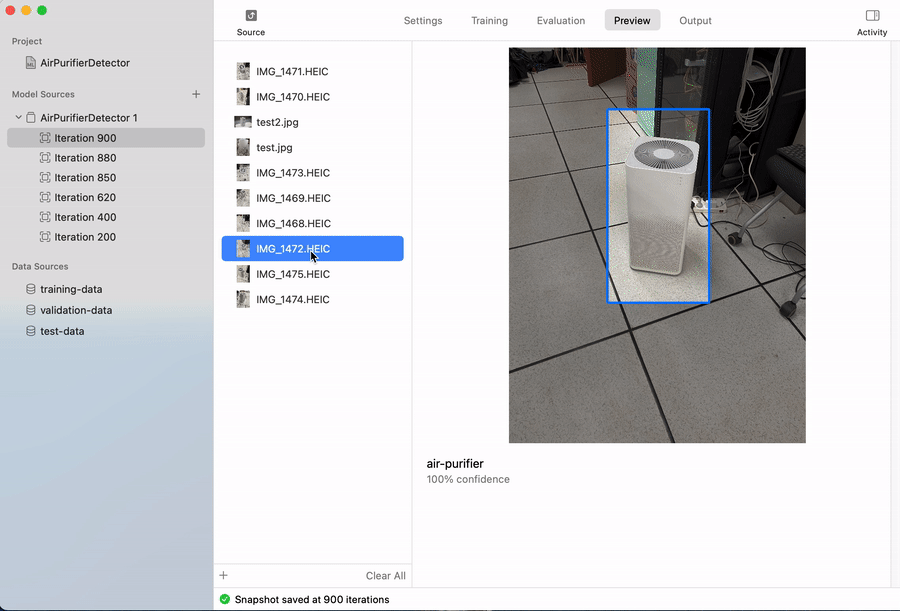

# CoreML + ARKit识别空气净化器并加入AR交互

## 进度

- 3月8日：收集了数据集用于训练空气净化器识别模型，使用CreateML框架进行迁移学习

  

- 问题：
  - 模型在Mac Pro上没问题，在笔记本上有问题，怀疑是M1的bug
  - 在CreateML中使用静态图片来测试，效果比较好，但是在iOS设备上使用摄像头捕捉到的数据，效果不是很好.

- 3月11日

  - 添加了AR内容的渲染和交互

  

  - 问题：1. 模型识别不够准确 2. hitTest的效果不好 3. SCNText的渲染有时会有问题